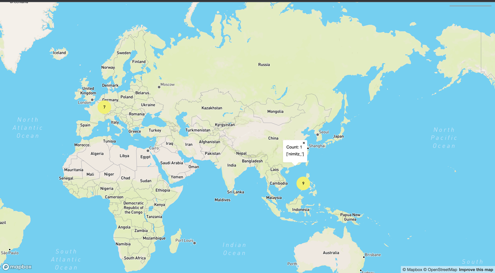

# MaxMap

---
**Maxmap** is a bot that allows discord users to share the cities they live with. Then, you can see a map with pins showing
server member's locations. You can use [this link](https://discord.com/api/oauth2/authorize?client_id=1120211992947478588&permissions=397284730944&scope=bot) to add it to your discord server. 


Example of the map

This is a remake of [this Maxmap bot](https://github.com/jozefws/MaxMap) created by Joe.
This version was created using PyCord, the [Mapbox](https://www.mapbox.com) Datasets API and MySQL. 
This project also uses [PositionStack](https://positionstack.com/documentation) to convert Lat, Long to a location string and vice-versa.


## Commands

---

- `map` returns a URL that will show a map of cities representing your server's members
- `add-city` add your city to the map
- `remove-city` remove your city from the map

## Data

---
**Maxmap** stores the minimal amount of user information in a MySQL database. It only stores server info like the guildID 
so that it knows which dataset to show.

- `add-city` stores your userid, the city and country that you input
- `remove-city` removes your userid, city and country from the database

## Credits
Credits to [Joe Sieniwaski](https://github.com/jozefws) for coming up with the idea and much of the inital codebase, and for his support 

## Setup Process for Running the Bot

This is ONLY if you wish to run the bot yourself, as a developer.

1. Ensure that you have Python 3.11 or higher installed
2. Create a `secrets.env` file and ensure that it is added to the .gitignore
3. Create a [Discord developer account](https://discord.com/developers/applications) and create a bot token and add it as `DISCORD_TOKEN=your_token` to `secrets.env`
4. Create a [mapbox account](https://account.mapbox.com/) and get a private token (with read/write dataset enabled) and call it `MAPBOX_SECRET_TOKEN`
5. Install MySQL and create a Database with the name `maxmap`
   1. If you have an error like `1044 (42000): Access denied for user 'maxmap'@'localhost' to database 'maxmap'`, then you need to open a mysql terminal and run `GRANT ALL PRIVILEGES ON maxmap.*  TO 'your_username'@'localhost';`
6. Run `pip install -r requirements.txt` to install all the Python dependencies
7. Create a [PositionStack](https://positionstack.com/documentation) API Key and add it to `secrets.env` as `POSITIONSTACK_KEY=Your_key`
8. Run `python 3 main.py`. Now your bot should be running and you should be able ot execute commands.
9. Host `web/index.html` using something like [Firebase](https://firebaseopensource.com/projects/firebaseextended/emberfire/docs/guide/deploying-to-firebase-hosting/)

By the end, you should have a `secrets.env` file that looks like:
```
DISCORD_TOKEN="Your discord bot token"

# Mapbox values
MAPBOX_SECRET_TOKEN="your mapbox secret key"
DATASET_ID="your mapbox dataset id"

# PositionStack keys
POSITIONSTACK_KEY="Your_positionstack_key"
```


### Notes and Caveats

In order to see changes in `index.html` appear in the webpage, need to cd into the `web/` directory and run 
`firebase deploy --only hosting` from command line

`Dataset`s are analogous to being a table/collection of entries, and represent a set of locations. Each discord server has a separate dataset.

`Feature`s represent individual entries in a `Dataset`, and represent a single location

### Links to other documentation:
Setting up Datasets and their Features: https://docs.mapbox.com/api/maps/datasets/

Pycord (slash commands): https://guide.pycord.dev/interactions/application-commands/slash-commands

PositionStack (place -> coordinates): https://positionstack.com/documentation

Basic example for hosting a webpage for the map: https://docs.mapbox.com/mapbox-gl-js/example/toggle-layers/

Clustering nearby points: https://docs.mapbox.com/mapbox-gl-js/example/cluster/

For firebase hosting: https://firebase.google.com/docs/hosting/quickstart

